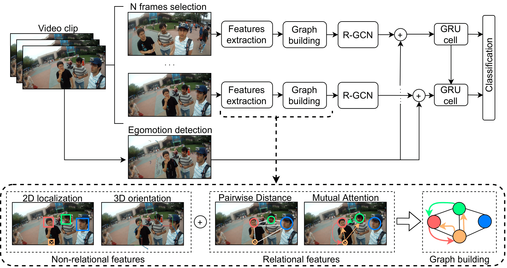

# InteractionGCN

This repository will contain the GCN-based implementation [1] for social interaction classification on GeorgiaTech Social Interaction dataset [2] available [here](http://cbs.ic.gatech.edu/egocentric/datasets.htm).

### Updates
- **20/05/2021**: Accepted to ICIP 2021.
- **08/06/2021**: Pretrained model and features are released.

### Features

The pretrained model and the features of GeorgiaTech dataset [2] are provided:
- Pretrained model is available in the `data/` folder.
- Relational and non-relational features are available in `data/all_features.zip`. Two types of files are given:
  - `f_*`: they contain the non-relational features for each individual for each frame with the following format: 
[ID, x_position, y_position, distance_from_camera, pitch, roll, yaw]

  - `d_*`: they contain the relational features for each frame, i.e. the distance between two people _i_ and _j_, with the following format: 
[ID_i, ID_j, distance]

- Homographies are available [here](https://drive.google.com/file/d/1KJlx1XYzBza4xOR06-OxdP9g2hZkbux3/view?usp=sharing).

### Challenging cases
In `examples/`, some challenging, failure and success examples are reported.

 

  

  Fig 1: Workflow of the framework. This extracts patterns of relational and non-relational cues at the frame level and uses them to build a relational graph from which the interactional context at the frame level is estimated via a Graph Convolutional Network (GCN) based approach. Then it propagates this context over time, together with first-person motion information, through a Gated Recurrent Unit (GRU) architecture.

 

  

  Fig 2: Classes of interactions. This illustrates the difficulty of the problem in the GeorgiaTech Social Interaction dataset, captured by a head-mounted wearable camera in an amusement park: five different conversation types may occur at different time intervals during a social interaction, even in absence of drastic visual changes, e.g, discussion vs dialogue.

### References
[1] [Interaction-GCN: a Graph Convolutional Network based framework for social interaction recognition in egocentric videos](https://arxiv.org/abs/2104.14007)

[2] [Social interactions: A first-person perspective](http://amav.gatech.edu/sites/default/files/papers/cvpr2012.Fathi_.Hodgins.Rehg_.printed.pdf)
